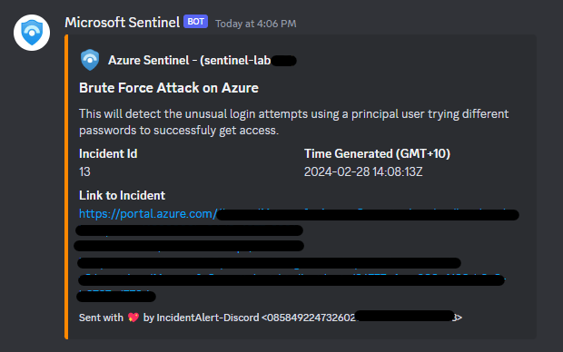
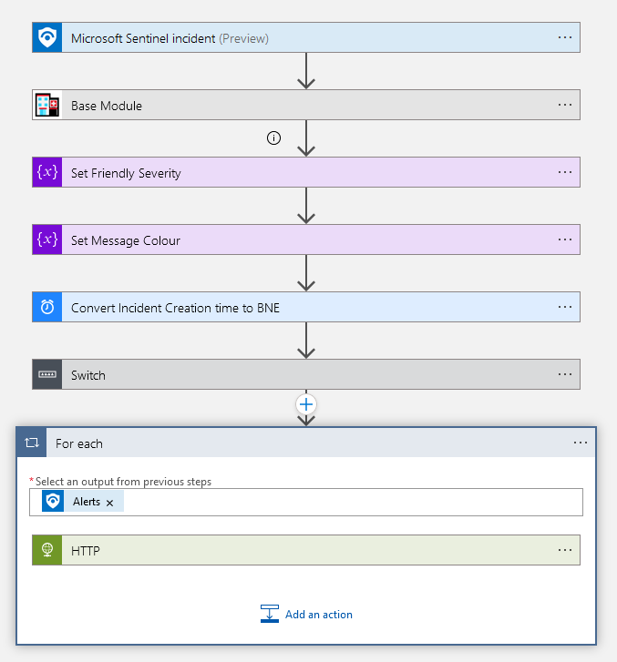
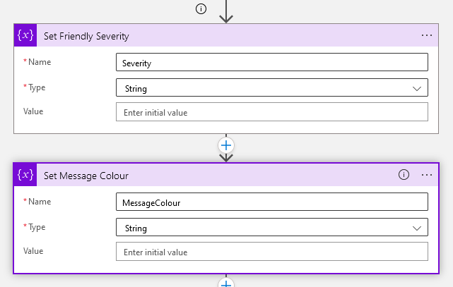
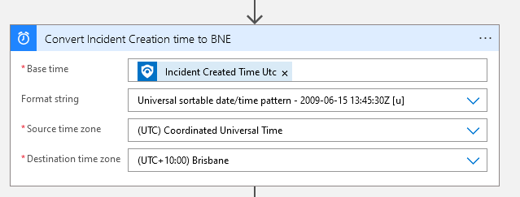
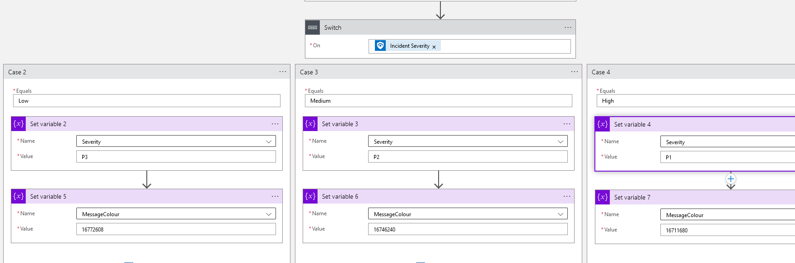
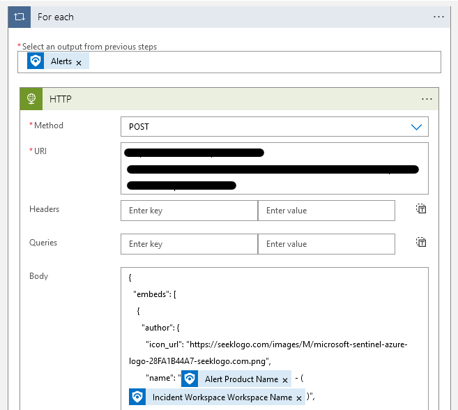

# Discord Webhook Notifications
---

This logic app takes incidents generated by Sentinel and sends them to a Discord Webhook. Please ensure you create an automation rule to invoke this playbook.

You may wish to modify:
* The MSTAT step (you can remove or skip if you don't use it - it doesn't get referenced in this logic app, I just include it out of habit..)
* Modify the fields in the HTML to reflect your environment
* Change the time zone step to convert to your timezone
* The icon URL. I'm using a random Sentinel logo I found on Google.

Things I want to add:
* Dynamically change the link to the workspace based on alert provider (e.g. link to Defender if the alert came from Defender)
* Parse entities nicely and add to the description of the notification
* Shorten the URL to the Sentinel incident

## Logic App Breakdown
First we set some variables:

Convert the timezone:

Set our Variables (not pictured is the P4 step):

Send the POST:
